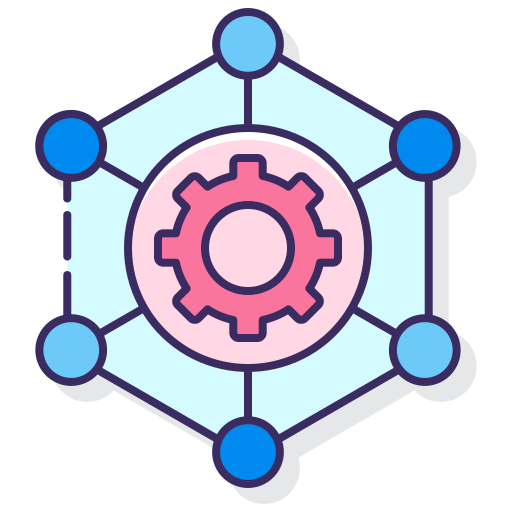

<!-- PROJECT LOGO -->
<br />
<p align="center">
  <a href="http://192.168.100.57:3000/Olivier_Luethy/Constant_Framework.git">
    
  </a>

  <h3 align="center">Constant-Framework</h3>
  <h4 align="center">A framework to create fast and easy a website that uses a database with PHP and MVC</h4>

  <p align="center">
    Here I'll explain how the framework works
    <br />
    <a href="http://192.168.100.57:3000/Olivier_Luethy/Constant_Framework.git/README.md"><strong>Explore the docs »</strong></a>
    <br />
    <br />
    <a href="http://192.168.100.57:3000/Olivier_Luethy/Constant_Framework.git">View Demo</a>
    ·
    <a href="http://192.168.100.57:3000/Olivier_Luethy/Constant_Framework.git/issues">Report Bug</a>
    ·
    <a href="http://192.168.100.57:3000/Olivier_Luethy/Constant_Framework.git/issues">Request Feature</a>
  </p>
</p>

<!-- TABLE OF CONTENTS -->
<details open="open">
  <summary>Table of Contents</summary>
  <ol>
    <li>
      <a href="#about-the-project">About The Project</a>
    </li>
    <li>
      <a href="#installation-guide">Installation Guide</a>
    </li>
  </ol>
</details>

<!-- ABOUT THE PROJECT -->
## About The Project
Since I was on a inter-company course for PHP and MVC, I've used it every time. But it cost me so much time, to build everything up very fast from scratch. So I've decided to create this framework, where I can copy it and use it directly for my next project. Now I don't need to start from 0%!

<!-- INSTALLATION -->
## Installation Guide
1. At first you need to install git on your local computer. For that you need to go to this [website](https://git-scm.com/downloads).
2. Go to your windows explorer and search for a good place for storing this project
3. Now right click on your folder or place and then click on "Git Bash Here"
4. Finally you will see something opened up like the windows command prompt. If you do you only have to enter this
   ```sh
   git clone http://192.168.100.57:3000/Olivier_Luethy/Constant_Framework.git
   ```
5. When you successfully cloned the project, you will need a local database. I used [XAMPP](https://www.apachefriends.org/de/index.html). If you want to use it too, then please make sure you download the latest version of it. Otherwise it doesn't mite work as expected.
6. If you have installed everything properly you can run the projects within the web browser by tipping in this command:
```sh
http://localhost/Constant_Framework/
```

<!-- DOCUMENTATION -->
The documentation for this framework you can find in the <strong>doc<strong> folder!